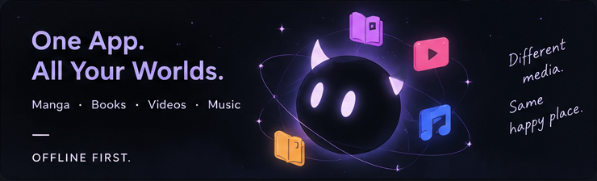

<div align="center">

<p align="center">
  
</p>


# 🌸 Hwaran (화란)
### *The Ultimate Private Offline Media Vault & Experience Engine for Android*

[](https://kotlinlang.org)
[](https://developer.android.com)
[](https://developer.android.com/jetpack/compose)
[](https://developer.android.com/guide/topics/media/media3)
[](https://developer.android.com/training/data-storage/room)
[](LICENSE)
[](CONTRIBUTING.md)

<p align="center">
  <b>Read, watch, and listen to your local media archive in a silky, handcrafted, 100% offline, privacy-first interface.</b>
</p>

</div>

---

## 📖 Overview

**Hwaran (화란)** is a modern, high-performance Android media client tailored for power users who hoard local content. It is **not** an online streaming client, and it **never** phones home.

Whether you collect:
- **Manga, Manhua & Webtoons** (image folders, continuous strips, CBZ/CBR)
- **Books & Technical Documents** (PDFs, multi-chapter books, and embedded media documents)
- **Novels & Plain Text** (EPUB, HTML, MOBI, PalmDoc, FB2, AZW, Markdown, TXT)
- **Anime & Structured Video Series** (Multi-season series, movies, OVAs, ONAs, specials, clips)
- **Music & Soundtracks** (FLAC, MP3, AAC, Opus, synchronized LRC lyrics, dynamic audio shaders)

Hwaran puts everything behind a single, unified, biometric/PIN-protected vault. It elevates your raw folder dumps with fluid 120Hz Jetpack Compose animations, ambient Canvas shader backgrounds, paragraph-accurate reading checkpoints, synchronized LRC lyrics, and customizable workspaces.

---

## 🚀 Key Features

```text
┌────────────────────────────────────────────────────────────────────────────────────────┐
│                                   HWARAN ECOSYSTEM                                     │
├────────────────────┬────────────────────┬────────────────────┬─────────────────────────┤
│ 📖 MANGA & TOONS   │ 📚 BOOKS & NOVELS  │ 🎬 ANIME & VIDEO   │ 🎵 MUSIC & SHADERS      │
├────────────────────┼────────────────────┼────────────────────┼─────────────────────────┤
│ • Continuous Strip │ • Hardware PDF     │ • ExoPlayer Engine │ • Media3 Service        │
│ • Paged LTR / RTL  │ • WebBook Engine   │ • 11 Relations     │ • 8 Canvas Shaders      │
│ • White Crop Zoom  │ • 6-Color Pastel   │ • Series & Channel │ • Synced LRC Lyrics     │
│ • 5,700+ Tags DB   │ • Checkpoints & %  │ • Gesture Controls │ • Smart Shuffle + Hist  │
│ • Natural Sorting  │ • Custom Font SAF  │ • PIP & Background │ • PopUp Mini Player     │
└────────────────────┴────────────────────┴────────────────────┴─────────────────────────┘
```

### 1. 📖 Manga & Manhua Engine (`contentType = 0`)
- **Dual Reading Engines**: Continuous vertical webtoon strip mode or page-by-page reader with LTR/RTL support.
- **Smart Edge Navigation & White Margin Crop**: Tap zones tuned for one-handed reading with automatic border cropping (100% to 150%).
- **5,700+ Master Tag Catalog**: Categorize libraries across 5,700+ curated genre and thematic tags with AND/OR logic.
- **Natural Chapter Sorter**: Intelligently handles decimal and sub-chapter numbering (e.g. `Chapter 10.5`).

### 2. 📚 Books & Documents Engine (`contentType = 1`)
- **Hardware-Accelerated PDF Renderer**: Fast, lag-free rendering using native Android `PdfRenderer`.
- **Soft Pastel Watercolor Highlighter**: Place translucent highlights and sticky note annotations directly on document pages with full Undo/Redo (Ctrl+Z/Y).
- **Interactive Link Extraction**: Detects and extracts embedded document URLs and cross-references.
- **Eye-Care Tint Modes**: Warm Sepia, Soft Mint, Dark OLED Mode, and Crisp Light.

### 3. 📜 Novels & WebBook Engine (`contentType = 4`)
- **Universal Text Decoding**: Seamless support for `.epub`, `.html`, `.mobi`, `.prc`, `.fb2`, `.azw`, `.azw3`, `.txt`, `.md`, and `.rtf`.
- **Granular Typography & Font Loader**: Fine-tune font sizes, line heights, paragraph spacing, and text justification. Load custom OTF/TTF fonts directly from storage via SAF.
- **Accurate Checkpoint System**: Bookmark exact chapters and paragraph offsets (`+ Mark Here`) with quick-jump sticky tabs and overall completion percentages.
- **Auto-Scroll Resumption**: Remembers exact scroll offsets and paragraph positions when opening or resuming books.

### 4. 🎬 Video & Anime Player (`contentType = 2`)
- **ExoPlayer Video Engine**: Hardware-accelerated playback for MP4, MKV, WebM, AVI, TS, and more.
- **Automated Series Hierarchy**: Detects complex franchise trees across 11 relationship types (Seasons, Sequels, Prequels, Movies, OVAs, ONAs, Specials, Blu-ray, Spinoffs, Recaps, Alt Versions).
- **Intuitive Player Gestures**: Smooth horizontal scrubbing with timestamp preview, left-side brightness adjustments, and right-side volume controls.

### 5. 🎵 Music & Audio Engine (`contentType = 3`)
- **Background MediaSessionService**: Fully integrated with Android system notifications, media controls, lock screen art, and Bluetooth headset events.
- **8 Handcrafted Reactive Canvas Shaders**:
  1. *Liquid* — Organic blob metaball physics that reacts to touch.
  2. *Constellation* — Orbital particle dynamics and connective star lines.
  3. *Crystal Snow* — Ambient crystalline snowfall particle physics.
  4. *Drunk Stars* — Floating, dreamy drifting star clusters.
  5. *Flower* — Blooming chromatic petal geometry.
  6. *Jellyfish* — Ambient underwater organic tentacles.
  7. *Kaleidoscope* — Symmetric refractive kaleidoscope geometry.
  8. *Neon Ripple* — Radiant neon wave ripple dynamics.
- **Synchronized LRC Lyrics**: Real-time karaoke-style lyrics scrolling with timecode synchronization and manual `.lrc` picker.
- **Shuffle Mode Playback History Back-Stack**: Seamlessly navigate back (`<`) in shuffle mode without re-shuffling.
- **Color Palette Extraction**: Dynamic UI theming extracted on the fly from embedded album art.

### 6. 🔒 Security & Vault Sandboxing
- **PIN & Biometric Protection**: Lock individual media items or entire vaults behind biometric authentication.
- **Local Vault Sandboxing**: Sandboxed storage mode with automatic `.nomedia` protection to isolate private files from Android's MediaStore.
- **Storage Access Framework (SAF)**: Link external folders directly without copying files or granting invasive root permissions.
- **`VaultMigrationService`**: Background service safely migrating items between external and private vault storage.

---

## 📊 Supported Format Matrix

| Media Domain | Supported Formats |
|---|---|
| **Manga / Comics** | Folders of JPG, PNG, WEBP, AVIF, JXL, GIF, CBZ, CBR |
| **Books / Documents** | PDF, EPUB, HTML, HTM, XHTML |
| **Novels / E-Books** | TXT, MD, MOBI, PRC, FB2, AZW, AZW3, RTF |
| **Video / Animation** | MP4, MKV, WEBM, AVI, TS, M4V, 3GP, MOV, FLV, WMV |
| **Audio / Soundtracks** | MP3, FLAC, AAC, M4A, OGG, OPUS, WAV, WMA |
| **Lyrics & Captions** | LRC (Synchronized & Plain), Embedded ID3 Lyrics, SRT, VTT |

---

## 🏛️ Architecture & Tech Stack

Hwaran follows **Feature-based Clean Architecture** with **Unidirectional Data Flow (UDF)**:

```text
┌────────────────────────────────────────────────────────┐
│                   Jetpack Compose UI                   │
│        (Screens, Reader Canvas, Ambient Shaders)       │
└────────────▲───────────────────────────────┬───────────┘
             │                               │
       State │ (StateFlow)            Events │ (User Actions)
             │                               ▼
┌────────────┴───────────────────────────────────────────┐
│              Lifecycle-Aware ViewModels                │
└────────────▲───────────────────────────────┬───────────┘
             │                               │
       Flows │ (Room / DataStore)   Commands │ (withContext(Dispatchers.IO))
             │                               ▼
┌────────────┴───────────────────────────────────────────┐
│           Repository & Central Importer Layer          │
├────────────────────────────────────────────────────────┤
│ Room Database (KSP) │ SAF Engine │ AndroidX Media3     │
└────────────────────────────────────────────────────────┘
```

| Component | Library / Technology |
|---|---|
| **Language** | Kotlin 2.0.21 |
| **UI Toolkit** | Jetpack Compose (BOM) + Material 3 |
| **Media Player** | AndroidX Media3 / ExoPlayer 1.5.0 + MediaSessionService |
| **Database** | Room 2.7.0 with KSP (SQLite Schema v16) |
| **Preferences** | Jetpack DataStore Preferences |
| **Image Loading** | Coil 2.7.0 (Compose, Video, GIF support) |
| **PDF Rendering** | Android Native `PdfRenderer` + `PdfiumAndroid` |
| **Storage Engine** | Android Storage Access Framework (SAF) / DocumentsContract |

---

## 🛠️ Building from Source

### Prerequisites
- **JDK**: Java 17 or Java 21 (Android Studio JBR: `/opt/android-studio/jbr`).
- **Android SDK**: `compileSdk = 37`, `minSdk = 26`, `targetSdk = 35`.
- **Android Studio**: Android Studio Ladybug / Meerkat or IntelliJ IDEA.

### Clone & Build
```bash
# 1. Clone the repository
git clone https://github.com/your-username/hwaran.git
cd hwaran

# 2. Export Java Home
export JAVA_HOME=/opt/android-studio/jbr  # or path to your JDK 17+

# 3. Compile Kotlin and run unit tests
./gradlew testDebugUnitTest

# 4. Build Debug APK
./gradlew assembleDebug
```

The compiled APK will be located at:
```text
app/build/outputs/apk/debug/app-debug.apk
```

---

## 🗂️ Project Directory Structure

```text
hwaran/
├── app/
│   └── src/main/java/com/ballade/hwaran/
│       ├── audio/              # Media3 Service & player instance provider
│       ├── backend/            # Business logic (Toon, Book, Novel, Video, Music, History, Workspace)
│       ├── core/               # Room DB (v16), DataStore, Metadata, HistoryTracker, SAF utils
│       ├── data/               # Repositories & centralized importers
│       ├── frontend/           # Presentation layer (Home, Players, Hubs, Editor, Canvas, Workspace)
│       └── ui/                 # ViewModels, 8 Canvas shaders, components, themes
├── docs/                       # Technical blueprints, database schema, changelogs, metadata spec
├── gradle/                     # Gradle wrapper & version catalogs
├── CONTRIBUTING.md             # Contribution guidelines & code of conduct
├── LICENSE                     # Apache 2.0 Open Source License
└── README.md                   # Project documentation & overview
```

---

## 📚 Documentation Map

Explore in-depth documentation inside the [`docs/`](docs/) directory:

- 🏛️ [**`docs/ARCHITECTURE.md`**](docs/ARCHITECTURE.md) — Technical blueprint, layering, data flow, and player lifecycles.
- 🗄️ [**`docs/DATABASE.md`**](docs/DATABASE.md) — Room schema (v16), table relationships, indexes, and migrations.
- 🎯 [**`docs/FEATURES.md`**](docs/FEATURES.md) — Full feature specifications and capabilities matrix.
- 🏷️ [**`docs/METADATA_SPEC.md`**](docs/METADATA_SPEC.md) — Comprehensive portable `.zine` and root JSON metadata specification.
- 🛠️ [**`docs/DEVELOPMENT.md`**](docs/DEVELOPMENT.md) — Build prerequisites, Gradle targets, and testing workflows.
- 📜 [**`docs/CHANGELOG.md`**](docs/CHANGELOG.md) — Chronological release history and major milestones.
- 🛡️ [**`docs/SECURITY.md`**](docs/SECURITY.md) — Security policy, local sandboxing, and vulnerability disclosure.
- 🤝 [**`CONTRIBUTING.md`**](CONTRIBUTING.md) — Developer guidelines and pull request instructions.

---

## 🤝 Contributing

Contributions are welcome! If you want to fix a bug, add a feature, or improve documentation:
1. Check the [Contribution Guide](CONTRIBUTING.md).
2. Fork the repository and create a branch off `nightingale`.
3. Commit with [Conventional Commits](https://www.conventionalcommits.org/).
4. Ensure all tests pass (`./gradlew testDebugUnitTest && ./gradlew assembleDebug`).
5. Open a Pull Request.

---

## 📄 License

Hwaran is open-source software licensed under the **[Apache License 2.0](LICENSE)**.
All media files and documents consumed within Hwaran remain the sole property of their respective owners.

<div align="center">
  <sub>Crafted with passion for offline media enthusiasts.</sub>
</div>
