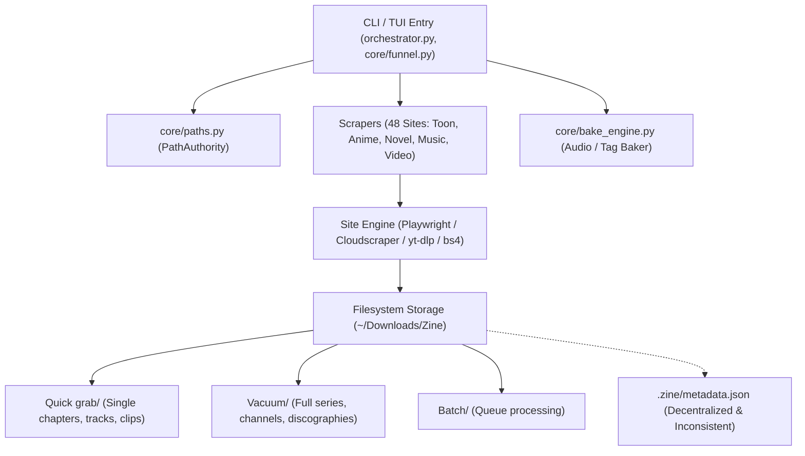

# Zine Scraper Deep Audit & Hwaran Integration Blueprint

## Executive Summary

This report delivers an exhaustive technical audit of the **Zine Scraper Suite** located at `/home/valse-de-anshu/.config/zine scraper/` and formulates a seamless integration strategy with **Hwaran** (`com.ballade.hwaran`).

Hwaran is designed as an offline-first, media-agnostic consumption hub (supporting Toon, Books, Novels, Videos, Audio, and Playlists). It relies on local storage structures and metadata manifests to achieve rich UI representation (synopses, author/artist credits, publication status, ratings, studio tags, release years, and cover artwork). **Zine Scraper is the primary ingestion and curation pipeline that feeds Hwaran.**

This document addresses:
1. **Zine Scraper Architecture & Code Audit** (strengths, bottlenecks, gaps).
2. **Metadata & Folder Alignment** with Hwaran's `ZineMetadataExtractor` and description screens (`ToonDescriptionView`, `BookDescriptionView`, `SeriesDescriptionView`, `ChannelDescriptionView`, `PlaylistDetailScreen`).
3. **Automating Zine Metadata**: Unifying the 48 heterogeneous scrapers under a single deterministic `MetadataEngine`.
4. **Mobile Feasibility: "Can a Phone Scrape?"** (Evaluating Chaquopy/Python vs Native Kotlin WebView/QuickJS vs Local Companion Bridge).
5. **Implementation Roadmap** to turn Zine + Hwaran into an end-to-end media ecosystem.

---

## 1. Zine Scraper Codebase Audit

### 1.1 Architecture & Component Mapping



* **Entry & Orchestration:** `orchestrator.py` and `core/funnel.py` provide a polished Rich TUI with ASCII banners, live progress indicators, interactive menus, and cbreak TTY input.
* **Storage Governance (`core/paths.py`):** `PathAuthority` defines three distinct ingest buckets:
  * `Quick grab`: Ad-hoc downloads (individual chapters, single YouTube videos, individual audio tracks).
  * `Vacuum`: Deep harvesting (complete manga runs, anime series, full channels, discographies).
  * `Batch`: Text-file-driven queue ingestion (`Batch URL.txt`).
* **Scraper Implementations (`scrapers/`):** 48 distinct site implementations spanning 6 media domains:
  * *Toon / Manga:* `mangadex`, `asurascans`, `manhuaplus`, `manhwaus`, `kunmanga`, `fanfox`, `weebcentral`, etc.
  * *Anime / Video:* `hianime`, `anitaku`, `anikoto`, `anineko`, `miruro`, `hanime`, `youtube`, `pornhub`, `ytdlp`.
  * *Light Novels:* `light_novel/novelbuddy`, `novelfire`, `novelphoenix`, `novelarchive`, `chikari`.
  * *Books:* `gutenberg`, `archive`.
  * *Music / Audio:* `soundcloud`, `idagio`, `youtube/yt_music`.
  * *Social / Visual Assets:* `pinterest`, `instagram`.
* **Auxiliary Engines:**
  * `core/bake_engine.py`: Interactive inline table editor embedding ID3/Vorbis/MP4 tags and cover art via Mutagen & FFmpeg.
  * `core/video_engine.py`: Video formatting, quality selection, and subtitles.
  * `core/lyrics_engine.py`: LRC synchronized lyric fetching.

---

### 1.2 Core Audit Findings: Strengths & Weaknesses

| Aspect | What Zine Scraper Does Well | Critical Bottlenecks & Weaknesses |
| :--- | :--- | :--- |
| **TUI & User Experience** | Beautiful Rich formatting, live spinners, clear download tables, keyboard-driven navigation. | Terminal-bound; cannot be triggered remotely or via mobile without manual SSH/CLI interaction. |
| **Site Coverage** | Broad coverage (48 modules) across diverse scrapers, light novels, and video sites. | High maintenance burden. Site DOM changes break extractors; duplicate logic across workflows. |
| **Bypass Capabilities** | Employs Playwright, Cloudscraper, and curl_cffi to navigate Cloudflare Turnstile and DDOS-Guard. | Heavy desktop dependencies (Node.js/Playwright browsers); cannot run on standard mobile OS runtimes. |
| **Folder Organization** | Predictable categorization into `Quick grab/`, `Vacuum/`, and `Batch/`. | Hwaran's importer expects content at specific directory depths; nested directories can create redundant nested "Boxes". |
| **Metadata Generation** | Writes `.zine/metadata.json` or `.zine/meta.json` in many workflows; covers saved as `cover.jpg`. | **Decentralized & Inconsistent:** Every scraper formats its own dict. Some omit genres, ratings, status, or `type`. Quick grab omits `.zine` completely! |

---

## 2. Metadata Alignment: Zine Scraper vs Hwaran Room v16

### 2.1 How Hwaran Ingests Metadata (`ZineMetadataExtractor.kt`)

Hwaran's import hierarchy enforces:
1. **Priority 1:** Look for any JSON inside `Material/.zine/*.json` (prefers `metadata.json`, `meta.json`, `entry.json`, `info.json`).
2. **Priority 2:** Look for root JSON `Material/*.json`.
3. **Priority 3:** Fallback to directory structure and filename heuristics.
4. **Dedicated Covers:** Image files named `cover.*`, `poster.*`, `folder.*`, `thumb.*` are treated strictly as artwork and excluded from media playlists/pages.

### 2.2 Field Mapping Matrix (Zine Output ➔ Hwaran Description Views)

To completely fill Hwaran's description screens without requiring any manual editing by the user in the app, the `.zine/metadata.json` must map to Hwaran's `EntryMetadata`:

| Hwaran Field (`EntryMetadata`) | Target Description View | Zine Scraper Current State | Required Standard Output in `.zine/metadata.json` |
| :--- | :--- | :--- | :--- |
| `title` | All Description Views | `title` or `name` | `"title": "Solo Leveling"` |
| `altTitle` | Toon, Series, Channel | Inconsistent (`japanese`, `alt_title`, or missing) | `"alt_title": "Na Honjaman Lebel-eop"` |
| `author` | Toon, Book, Channel | Inconsistent (`author`, `uploader`, `creator`, missing) | `"author": "Chugong"` |
| `artist` | Toon, Series, Music | Inconsistent (`artist`, `studio`, `studios`, missing) | `"artist": "DUBU (REDICE STUDIO)"` |
| `description` | All Views (Synopsis) | `description`, `synopsis`, or `summary` | `"description": "10 years ago, after the Gate opened..."` |
| `type` / `boxPurpose` | All Views (Badge) | **Omitted in 70% of scrapers!** | `"type": "Manga"` (or `"Manhua"`, `"Manhwa"`, `"Novel"`, `"Book"`, `"Series"`, `"Song"`, `"Channel"`) |
| `status` | Toon, Book, Series | `status` (some lowercase, some uppercase) | `"status": "Completed"` (or `"Ongoing"`) |
| `rating` | Toon, Series, Channel | `rating`, `mal_score`, `score`, or missing | `"rating": "8.86"` |
| `tags` | All Views (Chip row) | Array of strings, comma string, or `genres` | `"tags": ["Action", "Adventure", "Fantasy", "Supernatural"]` |
| `publisher` | Toon, Book, Series | `publisher`, `producers`, or missing | `"publisher": "D&C Media"` |
| `serialization` | Toon, Series | `serialization`, `magazine`, or `source` | `"serialization": "KakaoPage"` |
| `year` | All Views (Meta pill) | `year`, `aired`, `premiered`, or missing | `"year": "2018"` |
| `language` | Toon, Book, Series | `language` or `lang` | `"language": "en"` |
| `pages` | Book, Toon | Calculated or `pages` | `"pages": "179"` |
| `totalChapters` | Toon, Series, Music | `total_episodes`, `chapters`, or array length | `"total_chapters": 179` |
| `cover` | Hero Card Cover | `cover.jpg` saved to disk | `"cover": "cover.jpg"` |
| `url` | Source link chip | `url` or `source` | `"url": "https://mangadex.org/title/..."` |
| `views`, `likes` | Channel / Video view | In `youtube`, `pornhub`, missing elsewhere | `"views": "1.4M"`, `"likes": "95K"` |

---

### 2.3 The Three Discrepancies Causing Empty Hwaran Screens

1. **The "Quick Grab" Metadata Void:**
   In `mangadex/workflow.py` (and multiple other scrapers):
   ```python
   is_quick_grab = "Quick grab" in folder.parts or "Quick grab" in str(folder)
   if not is_quick_grab:
       zine_folder = folder / ".zine"
       # writes meta.json...
   ```
   *Impact:* Any item downloaded via "Quick grab" has **zero** `.zine` metadata. Hwaran imports it as an untagged folder with default placeholders.
2. **Missing Media Type (`type` / `box_purpose`):**
   When `type` is missing from JSON, Hwaran uses directory naming heuristics (`isComicLikeDir`, `isVideoLikeDir`). If the scraper saves to `~/Downloads/Zine/Vacuum/mangadex/Solo Leveling`, Hwaran does not see "Manga" in the folder name, risking fallback to generic folder mode instead of opening `ToonDescriptionView`.
3. **Array vs Comma-Separated Strings:**
   Certain scrapers write `"genres": "Action, Fantasy, Adventure"` while others write `"tags": ["Action", "Fantasy"]`. While Hwaran's `ZineMetadataExtractor` has fallback parsing, standardizing to a JSON array ensures zero parsing ambiguities and instant chip generation.

---

## 3. Concrete Action Plan: Standardizing Zine Scraper

To completely eliminate manual tagging and guarantee 100% metadata population in Hwaran, Zine Scraper should introduce a centralized `MetadataEngine`.

### 3.1 Proposed `core/metadata_engine.py`

Instead of individual scrapers manually opening `meta_path` and calling `json.dump()`, all scrapers should invoke:

```python
from dataclasses import dataclass, field, asdict
from typing import List, Optional
from pathlib import Path
import json

@dataclass
class ZineMetadata:
    title: str
    alt_title: Optional[str] = ""
    author: Optional[str] = ""
    artist: Optional[str] = ""
    description: Optional[str] = ""
    type: str = "Manga"  # "Manga", "Manhua", "Manhwa", "Novel", "Book", "Series", "Channel", "Song"
    status: Optional[str] = "Ongoing"  # "Ongoing", "Completed", "Hiatus"
    rating: Optional[str] = ""
    tags: List[str] = field(default_factory=list)
    publisher: Optional[str] = ""
    serialization: Optional[str] = ""
    year: Optional[str] = ""
    language: Optional[str] = "en"
    pages: Optional[str] = ""
    total_chapters: int = 0
    cover: str = "cover.jpg"
    url: Optional[str] = ""
    views: Optional[str] = ""
    likes: Optional[str] = ""
    comments: Optional[str] = ""

class MetadataEngine:
    @staticmethod
    def write(folder: Path, meta: ZineMetadata) -> Path:
        zine_dir = folder / ".zine"
        zine_dir.mkdir(parents=True, exist_ok=True)
        meta_file = zine_dir / "metadata.json"
        
        # Clean null/empty keys
        payload = {k: v for k, v in asdict(meta).items() if v not in [None, "", []]}
        # Always ensure type, title, and cover are preserved
        payload["title"] = meta.title
        payload["type"] = meta.type
        payload["cover"] = meta.cover

        with open(meta_file, "w", encoding="utf-8") as f:
            json.dump(payload, f, indent=4, ensure_ascii=False)
        return meta_file
```

### 3.2 Rules to Enforce in Scraper Workflows:
1. **Never skip `.zine` in Quick grab**: Even single-chapter or one-off video downloads should generate `.zine/metadata.json` so Hwaran renders full metadata immediately.
2. **Always write `cover.jpg`**: Scrapers should always download the highest resolution poster/thumbnail to `folder / "cover.jpg"`.
3. **Explicit Media Categorization**:
   * Manga/Manhwa/Manhua scrapers ➔ `"type": "Manga"` (or `"Manhua"`)
   * Light novel scrapers ➔ `"type": "Novel"`
   * Project Gutenberg / Archive books ➔ `"type": "Book"`
   * Anime / Pornhub / Video scrapers ➔ `"type": "Series"` or `"Channel"`
   * Music scrapers ➔ `"type": "Song"`

---

## 4. Mobile Feasibility: "Can a Phone Scrape?"

The user asked: **"Can a phone scrape? Can we add the zine scraper in our own app as well?"**

Here is the deep engineering analysis of running scrapers directly on Android.

### 4.1 Comparative Architectural Evaluation

```mermaid
flowchart TD
    subgraph OptionA["Option A: Embedded Python (Chaquopy / Termux)"]
        A1["Android App APK"] --> A2["Chaquopy / CPython Runtime"]
        A2 --> A3["Playwright FAIL (No Chromium on Android)"]
        A2 --> A4["yt-dlp (Slow, heavy ffmpeg bloat +100MB)"]
    end

    subgraph OptionB["Option B: Native Kotlin + WebView Engine (Tachiyomi Model)"]
        B1["Hwaran App"] --> B2["Android System WebView (Bypasses Cloudflare natively)"]
        B2 --> B3["Kotlin OkHttp + QuickJS / Duktape"]
        B3 --> B4["Direct SAF Writer to Material/.zine/"]
    end

    subgraph OptionC["Option C: Local Companion Bridge (Zine Daemon)"]
        C1["Desktop / Server Zine Daemon (Python, Playwright, yt-dlp)"]
        C1 <-->|"Local Wi-Fi (REST / WebSocket / mDNS)"| C2["Hwaran Android App"]
        C2 --> C3["Sends URL / Search Query"]
        C1 --> C4["Scrapes at Gigabit Speed & Serves Files"]
    end
```



### 4.2 Deep Dive into the 3 Approaches

#### Approach A: Embedded Python in Hwaran (Chaquopy / Pyodide)
* **How it works:** Bundling the Python runtime and Zine Scraper codebase inside the Hwaran Android APK using Chaquopy.
* **Why it struggles for full Zine parity:**
  1. **No Headless Browser:** Zine Scraper uses **Playwright** (`playwright install chromium`) to defeat Cloudflare Turnstile, DDOS-Guard, and render SPA JavaScript (e.g. AsuraScans, Miruro, HiAnime). **Playwright and headless Chromium cannot run inside standard Android sandboxed APKs** without root or Termux X11.
  2. **APK Bloat:** Python + PyO3/C-extensions + FFmpeg binaries + yt-dlp + Mutagen will inflate Hwaran's APK from ~18MB to **150MB+**.
  3. **Android Lifecycle & Battery:** Android OS aggressively kills background services executing long, CPU-intensive Python processes unless pinned with a high-priority foreground notification and wake-lock.
* **Verdict:** ❌ **Not recommended for the entire Zine suite.** Simple BS4/HTTP-only scrapers would work, but complex JS/Cloudflare scrapers will fail.

---

#### Approach B: Native Android Scraper Engine (The Tachiyomi/Mihon Architecture)
* **How it works:** This is how Tachiyomi/Mihon (for manga) and Cloudstream/Aniyomi (for anime) achieve mobile scraping.
  1. **Cloudflare Bypass without Playwright:** Instead of headless Chromium, Android apps use the **Android System WebView**. When a Cloudflare or Turnstile challenge is encountered, Hwaran instantiates a headless (or temporary modal) WebView using Android's native Chrome engine. Android's genuine Chrome signature passes Turnstile effortlessly. The app grabs the resulting `cf_clearance` cookie and passes it back to OkHttp.
  2. **Modular JS/Kotlin Extractors:** Scraper extractors are written either in Kotlin or executed via an embedded lightweight JavaScript runtime (like **QuickJS** or **Hermes**).
* **Pros:**
  * Ultra-lightweight: Adds < 5MB to Hwaran.
  * 100% native Android integration: Runs via Android `WorkManager` (can download in the background even while the screen is off).
  * Direct SAF writes: Saves directly into Hwaran's designated library folders, populating `.zine/metadata.json` immediately.
* **Cons:** Requires porting scraper logic from Python to Kotlin/JS.
* **Verdict:** ✅ **Best approach for direct, standalone in-app scraping on Android.**

---

#### Approach C: Local Companion Bridge (Zine Server Mode + Hwaran Client)
* **How it works:**
  1. Zine Scraper adds a `--server` mode (a lightweight FastAPI / Uvicorn daemon running on the user's PC or home server).
  2. Hwaran on the phone discovers the PC over local Wi-Fi (via mDNS / Zeroconf or entering the PC's IP / scanning a QR code).
  3. In Hwaran, the user can search, paste URLs, or queue downloads.
  4. The desktop runs the scrape using full desktop power (Playwright, gigabit Wi-Fi/Ethernet, unlimited disk space, yt-dlp, FFmpeg baking).
  5. The scraped folder (media + `cover.jpg` + `.zine/metadata.json`) is streamed/synced directly to the phone via HTTP, or mounted via SMB/WebDAV.
* **Pros:**
  * **Zero compromise:** You get 100% of Zine Scraper's capabilities (all 48 sites, Playwright, Cloudflare bypass, Mutagen baking) without compromising Android APK size or battery.
  * Fast downloads: Desktop CPU and networking handle heavy unpacking, remuxing, and metadata embedding.
* **Verdict:** 🌟 **Recommended for immediate, high-power desktop-to-mobile synergy.**

---

## 5. Recommended Strategic Roadmap

### Phase 1: Perfect Metadata Alignment (Immediate - Zine Scraper)
1. Add `core/metadata_engine.py` with standard `ZineMetadata` schema.
2. Update scrapers (starting with top used: MangaDex, AsuraScans, HiAnime, NovelBuddy, SoundCloud, YouTube) to write `type`, `tags`, `status`, `rating`, `author`, `artist`, `year`, `cover.jpg`.
3. Enable `.zine` generation in "Quick grab" mode so one-off downloads are never unindexed.

### Phase 2: Zine Companion Daemon (Medium Term - PC + App Bridge)
1. Add `zine --server [port]` to `orchestrator.py` using FastAPI.
2. Expose 3 endpoints:
   * `POST /api/scrape` (receives URL + mode)
   * `GET /api/status` (live download progress)
   * `GET /api/library/sync` (lists downloaded packages with `.zine` metadata for Hwaran to pull)
3. Add a "Connect to Zine" setting in Hwaran (`GlobalSettings.kt`) to trigger downloads and sync media seamlessly over Wi-Fi.

### Phase 3: Native On-Device Scraper Engine (Long Term - Inside Hwaran)
1. Introduce a Kotlin-based `ScraperEngine` inside Hwaran using `WebView` for cookie interception + OkHttp.
2. Adopt a plugin/extension architecture (similar to Mihon/Tachiyomi extensions or QuickJS scripts) allowing community scraper scripts to run directly on the phone.

---

## 6. Summary Comparison Matrix

| Capability | Current Desktop Zine CLI | Embedded Python in App | Native Kotlin/WebView Engine | Zine Wi-Fi Companion Bridge |
| :--- | :--- | :--- | :--- | :--- |
| **All 48 Sites Working** | 100% | ~40% (fails on Playwright/CF) | Requires porting extractors | 100% |
| **Cloudflare Turnstile Bypass** | Yes (Playwright) | No (Headless Chromium blocked) | Yes (via Android WebView) | Yes (Desktop Playwright) |
| **APK Size Impact** | 0 MB | +120 MB | +3 MB | 0 MB |
| **Battery Consumption** | None (runs on PC) | High (CPU throttling) | Very Low (Native Kotlin) | Low (Only Wi-Fi transfer) |
| **Hwaran UI Population** | 100% (with standardized `.zine`) | 100% | 100% | 100% |
| **Setup Complexity** | None (Already built) | Extreme (Chaquopy build issues) | Moderate (Build WebView bridge) | Low (Simple FastAPI daemon) |
